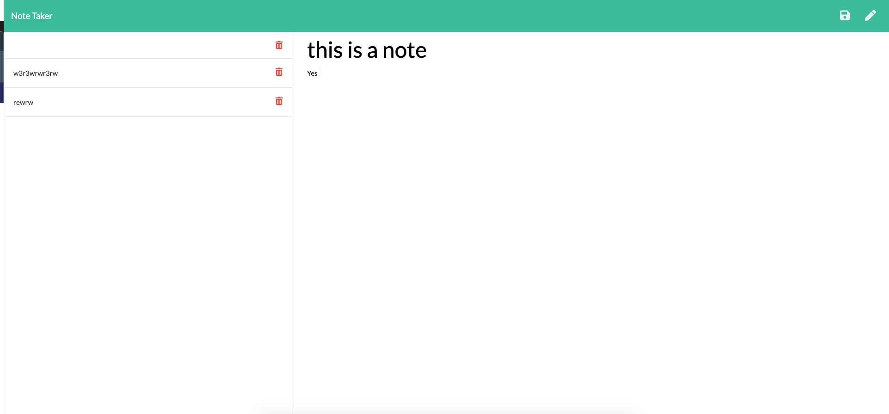

# Express Homework
In the web development world, servers provide a substatial amount of processing speed and power in the effeciency of a site. Using node, we can then create a server that allows us to use our knowledge of backend frameworks, and implement it into server desgin. We are given the intial frontend and scarce back-end files to start. Our goal is to tell the server how to store, interpret, and append the information we input.
# Site Picture

## Installing
Within the week of instruction we have learned an implemented express.js. Express is a javascript library like that of jest. Express in this project is used to create url links that the server can interact and interpret information from. 
Here's a quick procedure on how to install these tools
```
npm init -y
THEN:
npm install express
```
* Here you do two things: Initialize your directory for npm packages and install express itself, alongside its library of keywords. 

## Getting started
We are given Front-end and back-end components to this. Two html files, index.js, and a json file. We are then prompted to create a server.js file (Or any named file that is). We are then tasked to make the server interpret and append this information, intertwining everything within a server that we will then deploy on Heroku. Heroku is another cloud based runtime environment that is similar to github pages. More information about that below

## Heroku
Within the week of instruction, we have been asked to deploy our site within the heroku cloud. The code below will provide instruction on how to upload to heroku. 

```
heroku create
THEN:
git add .
THEN:
git push heroku master

```

* The code above will provide a link the deplioyed heroku link. 
# Deployed Link
[Link to the deployed link](https://floating-tundra-79028.herokuapp.com/)
[link to github repo](https://github.com/Kionling/express-hw)
# Authors 
* [Daniel Jauregui](https://kionling.github.io/responsive-portfolio1/)

## Acknowledgements 
* StackOverflow
* 16-Hot Restaurant Extended app 


https://floating-tundra-79028.herokuapp.com/